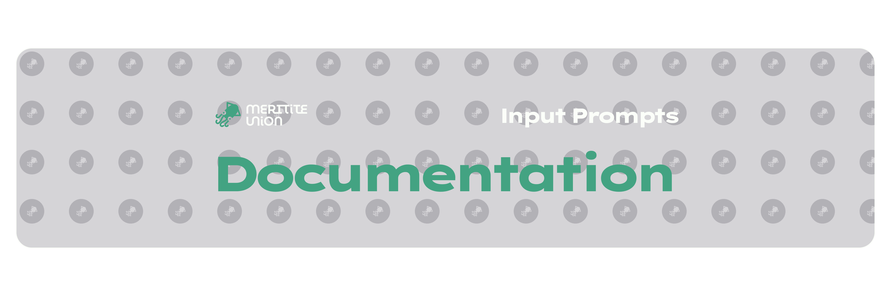
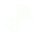

<picture>
  <source media="(prefers-color-scheme: dark)" srcset="github_assets/documentation_cover_dark.png">
  <source media="(prefers-color-scheme: light)" srcset="github_assets/documentation_cover_light.png">
  
</picture>
This is the complete documentation for the Meritite Union's Input Prompts.

## Supported platforms
- PC, Mac, Linux using a mouse and keyboard (`pc`)
- Xbox 360, Xbox One, Xbox Series (`xbox`)
- PlayStation 2, PlayStation 3, PlayStation 4, PlayStation 5 (`ps`)
- Nintendo Switch, Nintendo Switch 2 (`switch`)
- Nintendo Wii, Nintendo Wii U (`wii`)
- Generic, blank button shapes (`generic`)

Other platforms can be made by combining assets across platforms.
## Known issues
- Colors provided do not match their respective platforms.
- Arrows are not consistently present in PS symbols.
- Steam Deck prompts not yet available.
- Dark mode mouse prompts are not optically weighted.

## Definitions
- **Prompt** - A complete, individual icon or symbol as an image or vector file.
- **Control** - The analogous physical button, key, etc. being depicted. More than one control can be in a single prompt.
- **Label** - The text or symbol depicted on a control shape to identify it.

## File system and nomenclature
This section describes technical description of all file and directory naming. Its purpose is to help developers find the prompts they are looking for.
- For consistency, all files are arranged within a 7 subtype structure (6 directories + 1 filename).
- These categories are arranged as follows:
   - `platform` - The target platform for a respective prompt set: `xbox`, `pc`, etc.
   - `theme` - The theme for prompts: `light` or `dark`. Note this is based on the background, not color of the prompts themselves.
   - `type` - What on a controller the prompt represents: `button`, `dpad`, etc.
   - `category` - Where within that type of prompt the prompt falls: `bumper`, `primary`, `stick_click`, etc.
   - `subcategory` - If further categorization is necessary, a subcategory is provided (`l`, `r`, etc.). Note if this is not needed, `subcategory` is marked as `_`.
   - `fill` - Fill mode for individual prompt. If the prompt depicts a single control: `none`, `flat`, `solid`, `border`. If the prompt depicts multiple controls: `transparent`, `opaque`, `filled`.
   - `name.svg` _or_ `name.png` - The name of the specific prompt. Occasionally, variants of the same prompt will be in the same folder. In such a case, the filename will be adjusted accordingly.
- All filenames and directories are lowercase + digits 0-9. Underscores (`_`) are **only** used to signify a blank, such as no category or no buttons selected. Multiple words are combined with no separation (i.e. `synccolortext` for `sync` `color` `text`) to accomodate this.
### Types and their meanings
- `button` - *(Single fill mode)* The default prompt type. Indicates one standard button that can be pressed.
- `stick` - *(Multiple fill mode)* An analog thumbstick that can be rotated 360 degrees. These prompts include directional arrow markers for finer direction.
- `dpad` - *(Multiple fill mode)* A directional pad (D-pad). Directions are indicated through fill mode.
- `layout` - *(Multiple fill mode)* Displays the press state of a set of buttons (typically four directional buttons). Behaves similarly to `dpad`.
- `key` - *(Single fill mode)* A button on a keyboard. Behaves identically to `button`.
- `mouse` - *(Single fill mode)* Depicts a mouse with a click state or action.
### Categories
- `_` - Used to indicate no category, or in contrast to a variant category.
- `stick_click` - A button subcategory to indicate pressing the analog stick.
- `bumper` - The first row of side buttons on a standard controller, usually digital.
- `trigger` - The second row of side buttons on a standard controller, usually analog.
- `primary` - The large, often characteristic buttons on a controller, such as ABXY or XO□∆.
- `secondary` - Any `button` not belonging to another category.
- `eight` - A D-pad prompt with lines to emphasize 8-directional movement.
- `alphanum` - Standard layout keys A-Z and 0-9.
- `function` - Function (fn) keys F1-F24.
- `numpad` - Digits and calculator function keys on the number pad.
- `modifier` - Modifier keys, such as `shift`, `control`, or `winkey`.
- `special` - Miscellaneous standard keys with special properties, such as `backspace`, `tab`, and `space`.
- `legacy` - Legacy keys no longer in common use.

### Subcategories
- `_` - Used to indicate no subcategory, or in contrast to a variant subcategory.
- `color` - In controls that have a primary color, used in contrast to monochrome variants.
- `arrow` - Featuring directional arrows.
- `primary` - Featuring characteristic buttons on a controller, such as ABXY or XO□∆.
- `side` - Indicating side bumpers for `ns` platforms.
- `l` and `r` - For `stick` controls to indicate which stick is referred to.
- `common` - A subset of common keys often used in PC gaming. Prompts here are duplicated from other subcategories.
- `letter` - Letter keys A-Z.
- 'number` - Digit keys 0-9.
- `windows` - Keys that are specific to the Windows platform.
- `mac` - Keys that are specific to the macOS platform.
- `extra` - Additional variant keys with less usage to prevent cluttering in other subcategories. Includes keys from international locales. **Not included in present version**
- `alt` - A group of alternate prompts grouped together.
- `classic` - A group of alternate prompts grouped together for older versions of a platform. **Not included in present version**
### Fill modes
#### Single fill mode
These fill modes are indicated for prompts depicting a single control.
- `none` - A partially transparent border around control shape with an opaque inner label.
- `flat` - Similar to `none`, but with a fully opaque border.
- `solid` - A filled in control shape with no border. Inner label cut out.
- `border` - Similar to `solid`, but with an added partially transparent border for emphasis.

<!--- Disgusting table for single fill mode examples --->
| `none` | `flat` | `solid` | `border` |
| --- | --- | --- | --- |
| <picture><source media="(prefers-color-scheme: dark)" srcset="https://github.com/meritite-union/input-prompts/blob/main/github_assets/sample_fill_modes/dark/button/primary/_/none/a.png"><source media="(prefers-color-scheme: light)" srcset="https://github.com/meritite-union/input-prompts/blob/main/github_assets/sample_fill_modes/light/button/primary/_/none/a-1.png"></picture> | <picture><source media="(prefers-color-scheme: dark)" srcset="https://github.com/meritite-union/input-prompts/blob/main/github_assets/sample_fill_modes/dark/button/primary/_/flat/a.png"><source media="(prefers-color-scheme: light)" srcset="https://github.com/meritite-union/input-prompts/blob/main/github_assets/sample_fill_modes/light/button/primary/_/flat/a-1.png"></picture> | <picture><source media="(prefers-color-scheme: dark)" srcset="https://github.com/meritite-union/input-prompts/blob/main/github_assets/sample_fill_modes/dark/button/primary/_/solid/a.png"><source media="(prefers-color-scheme: light)" srcset="https://github.com/meritite-union/input-prompts/blob/main/github_assets/sample_fill_modes/light/button/primary/_/solid/a-1.png"></picture> | <picture><source media="(prefers-color-scheme: dark)" srcset="https://github.com/meritite-union/input-prompts/blob/main/github_assets/sample_fill_modes/dark/button/primary/_/border/a.png"><source media="(prefers-color-scheme: light)" srcset="https://github.com/meritite-union/input-prompts/blob/main/github_assets/sample_fill_modes/light/button/primary/_/border/a-1.png"></picture> |
#### Multiple fill mode
These fill modes are indicated for prompts depicting multiple controls.
- `transparent` - `none` indicates false. `border` indicates true.
- `opaque` - `flat` indicates false. `solid` indicates true.
- `filled` - `solid` indicates false. `border` indicates true. Recommended only for large use due to low contrast.

<!--- Disgusting table for multiple fill mode examples --->
| `transparent` | `opaque` | `filled` |
| --- | --- | --- |
| <picture><source media="(prefers-color-scheme: dark)" srcset="https://github.com/meritite-union/input-prompts/blob/main/github_assets/sample_fill_modes/dark/layout/_/primary/transparent/d.png"><source media="(prefers-color-scheme: light)" srcset="https://github.com/meritite-union/input-prompts/blob/main/github_assets/sample_fill_modes/light/layout/_/primary/transparent/d.png"></picture> | <picture><source media="(prefers-color-scheme: dark)" srcset="https://github.com/meritite-union/input-prompts/blob/main/github_assets/sample_fill_modes/dark/layout/_/primary/opaque/d.png"><source media="(prefers-color-scheme: light)" srcset="https://github.com/meritite-union/input-prompts/blob/main/github_assets/sample_fill_modes/light/layout/_/primary/opaque/d.png"></picture> | <picture><source media="(prefers-color-scheme: dark)" srcset="https://github.com/meritite-union/input-prompts/blob/main/github_assets/sample_fill_modes/dark/layout/_/primary/filled/d.png"><source media="(prefers-color-scheme: light)" srcset="https://github.com/meritite-union/input-prompts/blob/main/github_assets/sample_fill_modes/light/layout/_/primary/filled/d.png"></picture> |

### Filenames
Filenames themselves are written as if they are themselves a final subcategory. As such, a filename itself is not enough to determine the exact prompt variant in question, only enough to distinguish it from other prompts in the same subcategory and fill mode. In fact, individual file names are often exactly the same across folders (`a.svg` and `a.svg` in `light` and `dark` theme, `color` or monochrome, etc.) Please use the structure of parent directories to determine prompts.
#### WASD
Prompts with multiple controls have standard nomenclature to indicate which control(s) are 'selected'. Directions up, left, down, and right, are described using `w`, `a`, `s`, and `d` respectively. Multiple controls are named by combining these letters in WASD order. Blank prompts (with no controls 'selected') are named simply as `_`. Stick controls additionally have diagonal variants, which are prefixed with `dia` followed by their respective direction in WASD.

<!-- Awful table for directional arrows WASD guide -->
| `_.svg` | `wasd.svg` | `w.svg` | `wa.svg` | `diawa.svg` |
| --- | --- | --- | --- | --- |
| <picture><source media="(prefers-color-scheme: dark)" srcset="https://github.com/meritite-union/input-prompts/blob/main/github_assets/sample_fill_modes/dark/stick/_/_/solid/_.png"><source media="(prefers-color-scheme: light)" srcset="https://github.com/meritite-union/input-prompts/blob/main/github_assets/sample_fill_modes/light/stick/_/_/solid/_.png"></picture> | <picture><source media="(prefers-color-scheme: dark)" srcset="https://github.com/meritite-union/input-prompts/blob/main/github_assets/sample_fill_modes/dark/stick/_/_/solid/wasd.png"><source media="(prefers-color-scheme: light)" srcset="https://github.com/meritite-union/input-prompts/blob/main/github_assets/sample_fill_modes/light/stick/_/_/solid/wasd.png"></picture> | <picture><source media="(prefers-color-scheme: dark)" srcset="https://github.com/meritite-union/input-prompts/blob/main/github_assets/sample_fill_modes/dark/stick/_/_/solid/w.png"><source media="(prefers-color-scheme: light)" srcset="https://github.com/meritite-union/input-prompts/blob/main/github_assets/sample_fill_modes/light/stick/_/_/solid/w.png"></picture> | <picture><source media="(prefers-color-scheme: dark)" srcset="https://github.com/meritite-union/input-prompts/blob/main/github_assets/sample_fill_modes/dark/stick/_/_/solid/wa.png"><source media="(prefers-color-scheme: light)" srcset="https://github.com/meritite-union/input-prompts/blob/main/github_assets/sample_fill_modes/light/stick/_/_/solid/wa.png"></picture> | <picture><source media="(prefers-color-scheme: dark)" srcset="https://github.com/meritite-union/input-prompts/blob/main/github_assets/sample_fill_modes/dark/stick/_/_/solid/diawa.png"><source media="(prefers-color-scheme: light)" srcset="https://github.com/meritite-union/input-prompts/blob/main/github_assets/sample_fill_modes/light/stick/_/_/solid/diawa.png"></picture>

#### Suffixes
When more subcategories of prompts are required than is available in the file structure, they are appended to the filename.
- `alt` - A generic suffix indicating an alternate prompt. 
- `button` - Indicates that the control is wrapped in a standard circular button. It is often used as an alternative to custom and complex control shapes. 
- `color` - Indicates the prompt is colored in contrast to standard monochrome.
- `ring` - For `wii` platform, indicates home button is colored with a blue ring.
- `text` - Indicates that a prompt label is written in text rather than with an abstract symbol.

## Visual documentation
This section describes visual technicalities in how the prompts were designed. It may be useful to developers looking to extend or customize Input Prompts to their individual project's needs.
### Composition
Input Prompts was created 100% in Figma with no AI. Prompts are formed through nested components in a 128x128 frame - mainly labels within shapes. These are laid out on the `components` page on Figma. **Shapes** are the base layer and compose of the basic control's shape. They feature all of the single fill modes and light and dark themes. They have a default label to align boolean subtract cutouts and positioning, which is swapped with Swap Instance as needed. **Labels** are the text or symbols that overlay the shapes (controls), and only have light and dark variants (for optical width - see below). On each platform page, a shape is chosen with a label, with text values and sometimes colors manually adjusted. Therefore, when a change is made to an individual component, the change is reflected in all prompts that use that component.
### Fonts
Input Prompts uses the [Lexend](https://fonts.google.com/specimen/Lexend) font family, including its wide variants. All text styles are listed within the Figma file. Font size is largely determined by spacing constraints.
**Deca**—the standard width of Lexend—is the default, preferred for key labels, or when using words as 'words', although this decision is subjective.
Wider fonts, **Exa**, **Tera**, **Mega**, and all the way up to **Zetta** are used for extra emphasis and are common for named buttons, triggers, bumpers, etc.

### Colors
Starting in v2.0, colors have been streamlined to 4 basic shades for monochrome prompts.

### Optical width and alignment
Certain shapes, such as arrows and triangles, are positioned slightly off center for optical alignment. Circle shapes are slightly larger than squares to appear of equal size.

## Customization
Depending on your project's needs, or to make your own fork of the project, you may wish to make changes to Input Prompts. This process is relatively straightforward and depends on what kinds of changes you need. To make changes, you will need to make a copy of the [Figma file](https://www.figma.com/community/file/1354930683181049242/input-prompts) and re-export the prompts you need.
### Project-wide changes
#### Color and text styles
To change colors, select the `Variables` tab, and change the colors to your needs. Note that this will affect the colors of every prompt across the project. To change colors for a single prompt, select it and unlink the color variable, then customize from there.
To change text styling, fonts, spacing, etc., deselect any items on the page (so that the background canvas information appears), and edit styles on the right under `Text Styles`.
#### Adjusting base shapes
To adjust a base prompt component shape, navigate to the `components` tab and find the shape you'd like to edit. Make any changes to this base shape (corner radius, dimensions, etc.) and the changes will be reflected automatically all prompts that use that base shape.
#### Adjusting prompt labels
To adjust a prompt label's text, find an prompt featuring the label you'd like to edit and select it until you have reached text-edit mode. Use the multi-edit text to adjust as you see fit. This change may not be reflected universally, so pay attention to what has been selected and repeat the process with other prompts as you needed. In particular, `solid` and `border` fill modes may not edit with unfilled variants due to differences in where the text is layered within each frame.

### Creating custom icons
Due to the modular, component-based format 

<picture>
  <source media="(prefers-color-scheme: dark)" srcset="github_assets/new_logo_dark.png">
  <source media="(prefers-color-scheme: light)" srcset="github_assets/new_logo_light.png">
  
</picture>