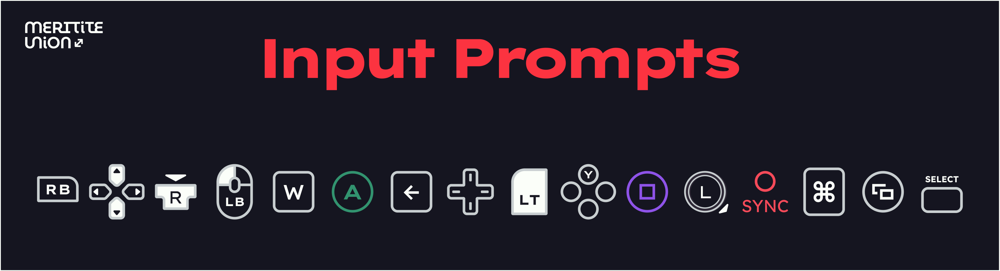

<picture>
  <source media="(prefers-color-scheme: dark)" srcset="github_assets/cover_dark.png">
  <source media="(prefers-color-scheme: light)" srcset="github_assets/cover_light.png">
  
</picture>

## 1000+ iconos vectoriales y rasterizados por todas sus necesidades de gamedev.
###### [English](README.md) [日本語](README.ja-jp.md) **español**
Indicaciones de entrada del controlador ("**prompts**") de PlayStation, Xbox, y PC son listas y disponibles ahora.
Prompts de Nintendo Switch son en desarrollo.
¡Prompts de Wii / Wii U, Steam Deck, generico, y más van pronto!

Esa asset pack es hecho por @hergergy de una parte de la Meritite Union.

Input Prompts es autorisado por el derecho CC0 1.0 Universal. Permiso es concedido de usar, distribuir, y modificar estos recursos. Atribución no es necesaria, pero siempre apreciado. Ahora, este proyecto no es conectado a nada oficial, luego apreciaría simplemente regresar más tarde por proyectos futuros.

Este proyecto es directamente inspirado por [Kenny’s Input Prompts](https://www.kenney.nl/assets/input-prompts) y de [Xelu](https://thoseawesomeguys.com/prompts/) también. Si a usted no le gusta mío, las mira.

# Guía
## Seudoinstalación
Todo necesesita es incluido en una archivo de `.zip`. Descargue la [ultima versión](https://github.com/meritite-union/input-prompts/releases/latest) de cualquiera de las fuentes publicadas y usted va a estar bien.
## Estructura de carpeta
La estructura de carpeta es `formato / plataforma / tema / categoría / subcategoría / matiz / variante.formato`, cuando:
- `formato`: `256-png` para imágines 256x256px (2x upscale de Figma) o `svg` para gráficos vectoriales (por escala estándar 128x128).
- `plataforma`: `xbox`, `ps` para PlayStation, o `pc` para teclado y ratón. (solamente actualmente)
- `tema`: `light` para modo de luz o `dark` para modo oscuro.
- `categoría`: Varía según la plataforma.
- `subcategoría`: Misma como `categoría`. No todas las categorías son subcategorizada.
- `matiz`: En prompts representando un solo control, `_` y `fill`. El variante fill es destinada para mostrar un estato activo. En otras categorías donde controles múltiples son representados, como `dpad` o `mouse`, es cubierto por variante.
- `variante`: El nombre del archivo se nombra según el control específico o el variante que el prompt representa.

Esto tiene algunas implicaciónes que puede impactar como usa estas assets.
- Nombres de archivos no son necesariamente únicos—la estructura de carpetas es información necesaria para obteneter el signicicado del prompt. Por ejemplo, el D-pad arriba **y** palanca izquierda arriba tienen lo mismo nombre del archivo, `w.svg`, pero solamente se distinguen por su posición.
- Por extensión, las imágines puede no ser únicas. El pack se diseña para tener todas las assets de una platform sean autónoma dentro la carpeta respectiva, incluyo si eso significa que el mismo prompt se almacena veces múltiples. Por ejemplo, si se desarrollara un juego por solo Xbox, se podría encontrar los prompts de palanca izquierda en la carpeta `xbox`, incluyo si los PlayStation sean idénticos.
## Formato de archivos
Esta información se relaciona con la formata `.svg`.

Todos prompts se caben dentro una caja delimitadora 128x128px. Generalmente, anchura del trazo es 6 píxeles. Colores estándares usados incluyan  `#191923`,  `#2E2836`,  `#C8CED0`, y  `#FBFEF9`. Estas colores corresponder con los estándar de la Meritite Union, pero se pueden que no coincida con su marca o juego. Puede usar algún software de SVG de que soy inconsciente, pero si necesita cambiarlos, Recomendo modificar y exportar los iconos del [archivo de Figma](https://www.figma.com/community/file/1354930683181049242/input-prompts) directamente. Una otra cosa a notar es que los prompts colorados de Xbox y PlayStation **no** coincida con los colores oficiales. En cambio, son los colores del Meritite Union. Eso es para evitar posibles infracciones de marcas registradas.

Para ayudarlo con importar a cualquier sistema que usa, he formatado los nombres de archivo para evitar que sus aplicaciónes se enojen. Nombres constan únicamente de letras minúsculas a-z, guión bajo `_` y dígitos 0-9. Además, ningún nombre comienza con un dígito. 

Por favor envíenme sus comentarios abriendo un [Issue de GitHub](https://github.com/meritite-union/input-prompts/issues/new). ¡Incluya problemas de traducir, por favor!

¡Gracias por su interés!
\
\
\

