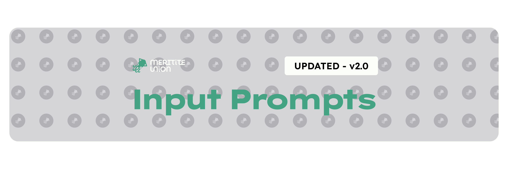

<picture>
  <source media="(prefers-color-scheme: dark)" srcset="github_assets/cover_dark.png">
  <source media="(prefers-color-scheme: light)" srcset="github_assets/cover_light.png">
  
</picture>

## 1000+ vector & raster icons for all your game development needs.
###### **English** [日本語](README.ja-jp.md) [español](README.es.md)
Major Release - Updated for Version 2.0! Platforms supported:

* Mouse / Keyboard
* PlayStation
* Xbox
* Nintendo Switch / 2
* Wii / Wii U
* Generic

Hi! This asset pack was made by @hergergy who sometimes uses Meritite Union for games stuff.

Input Prompts is licensed under CC0 1.0 Universal. Permission is granted to use, distribute, and modify these resources. Attribution is not required, but always appreciated--publicity is the best support. Right now this project is not tied to anything official, so I would appreciate simply coming back later at future projects.

128 x 128 prompts available in both .svg and  256px .png formats.

This project is directly inspired by [Kenny’s Input Prompts](https://www.kenney.nl/assets/input-prompts). [Xelu’s](https://thoseawesomeguys.com/prompts/) too. If you don’t like mine, check out theirs!

# Guide
## "Installation"
Everything you need is included in a single `.zip` file. Download the [latest version](https://github.com/meritite-union/input-prompts/releases/latest) from any of the published sources and you should be good to go. 
## Documentation
Detailed documentation is now available, which lists 
\
\
\

